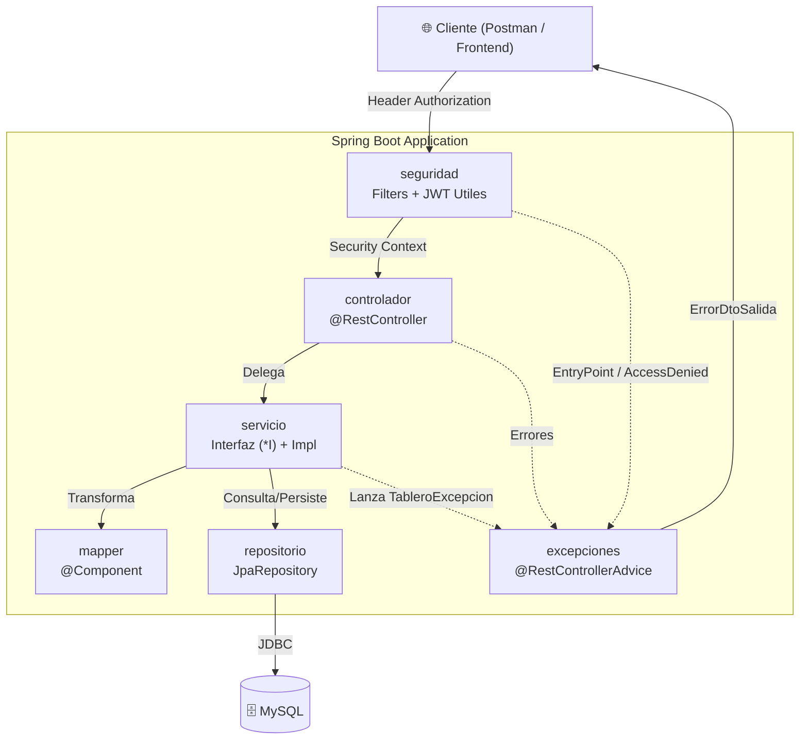
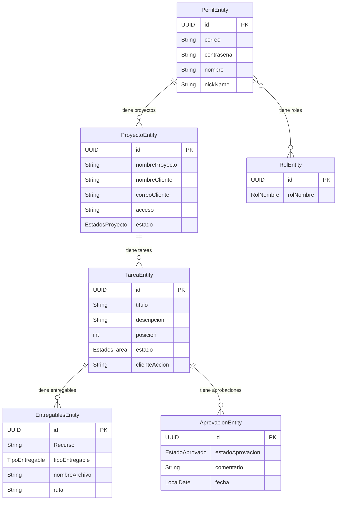

# Arquitectura del Sistema

## Patrón Arquitectónico

El proyecto sigue una **Arquitectura en Capas (Layered Architecture)** monolítica, organizada por capa técnica (*Package-by-Layer*).

## Responsabilidad por Capa

| Paquete | Responsabilidad | Regla Clave |
|---------|----------------|-------------|
| `seguridad` | Autenticación JWT, filtros y configuración | Totalmente Stateless |
| `controlador` | Expone endpoints REST, delega al servicio | Cero lógica de negocio |
| `servicio/interfaces` | Define contratos (sufijo `*I`) | Toda operación pasa por la interfaz |
| `servicio/impl` | Implementa la lógica de negocio | Inyecta repositorios y mappers |
| `repositorio` | Acceso a datos vía Spring Data JPA | Interfaces que extienden `JpaRepository` |
| `mapper` | Transforma Entity ↔ DTO | Clases `@Component`, mapeo manual |
| `entidades/entidades` | Modelos JPA mapeados a tablas MySQL | Sufijo `Entity`, usan Lombok |
| `entidades/dtos/entrada` | Payloads de request (`@Valid`) | Sufijo `DtoEntrada` |
| `entidades/dtos/salida` | Payloads de response | Sufijo `DtoSalida` |
| `entidades/entidades/enums` | Constantes de estado | Persistidos como `EnumType.STRING` |
| `excepciones/excepcion` | Excepción personalizada del proyecto | `TableroExcepcion extends RuntimeException` |
| `excepciones/handler` | Interceptor global de errores | `@RestControllerAdvice` |
| `configuracion` | Configuraciones técnicas adicionales | Bean definitions |

## Diagrama de Relaciones entre Entidades

## Flujo de una Petición Típica (Autenticada)

1. El **Cliente** envía una petición HTTP con el header `Authorization: Bearer <token>`.
2. El interceptor de **Seguridad** valida el JWT y establece el contexto de seguridad.
3. Si es válido, la petición llega al **Controlador**.
4. El Controlador valida el DTO de entrada (`@Valid`) y delega al **Servicio**.
5. El Servicio ejecuta la lógica de negocio y persiste/consulta al **Repositorio**.
6. Si ocurre un error de seguridad (token inválido o roles insuficientes), los manejadores de seguridad retornan un `ErrorDtoSalida`.
7. Si ocurre un error de negocio, el `ManejadorGlobalExcepciones` retorna un `ErrorDtoSalida`.
8. Si todo es exitoso, se retorna un `ResponseEntity<T>` con el código HTTP apropiado.
