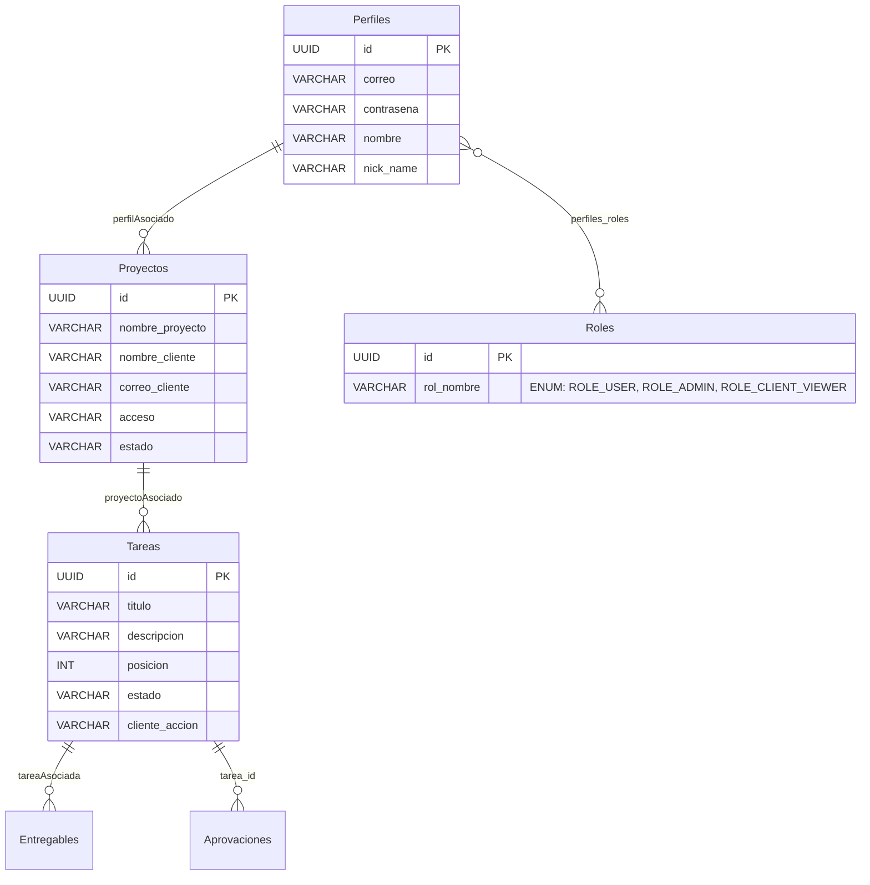

# Esquema de Base de Datos

## Motor y Configuración

| Parámetro | Valor |
|-----------|-------|
| Motor | MySQL 8+ |
| Driver | `com.mysql.cj.jdbc.Driver` |
| Dialecto | `org.hibernate.dialect.MySQLDialect` |
| DDL Auto | `update` (Hibernate genera/actualiza tablas automáticamente) |
| Sesiones | `spring-session-jdbc` con `initialize-schema=always` |

## Diagrama Entidad-Relación

## Detalle de Entidades

### PerfilEntity → Tabla `Perfiles`

| Campo | Tipo Java | Columna DB | Restricciones |
|-------|-----------|------------|---------------|
| `id` | `UUID` | `id` | PK |
| `correo` | `String` | `correo` | Unique, Not Blank |
| `contraseña` | `String` | `contraseña` | Not Blank (Bcrypt) |
| `nombre` | `String` | `nombre` | - |
| `nickName` | `String` | `nick_name` | - |
| `roles` | `Set<RolEntity>` | - | `@ManyToMany` |
| `proyectos` | `List<ProyectoEntity>` | - | `@OneToMany` |

### RolEntity → Tabla `roles`

| Campo | Tipo Java | Columna DB | Restricciones |
|-------|-----------|------------|---------------|
| `id` | `UUID` | `id` | PK |
| `rolNombre` | `RolNombre` | `rol_nombre` | Unique, Not Null |

### ProyectoEntity → Tabla `Proyectos`

| Campo | Tipo Java | Columna DB | Restricciones |
|-------|-----------|------------|---------------|
| `id` | `UUID` | `id` | PK |
| `nombreProyecto` | `String` | `nombre_proyecto` | - |
| `nombreCliente` | `String` | `nombre_cliente` | - |
| `correoCliente` | `String` | `correo_cliente` | - |
| `acceso` | `String` | `acceso` | - |
| `estado` | `EstadosProyecto` | `estado` | - |
| `perfilAsociado` | `PerfilEntity` | FK | `@ManyToOne` |

### TareaEntity → Tabla `Tareas`

| Campo | Tipo Java | Columna DB | Restricciones |
|-------|-----------|------------|---------------|
| `id` | `UUID` | `id` | PK |
| `titulo` | `String` | `titulo` | Not Blank |
| `descripcion` | `String` | `descripcion` | - |
| `posicion` | `int` | `posicion` | - |
| `estado` | `EstadosTarea` | `estado` | - |
| `proyectoAsociado` | `ProyectoEntity` | FK | `@ManyToOne` |

### EntregablesEntity → Tabla `Entregables`

| Campo | Tipo Java | Columna DB | Restricciones |
|-------|-----------|------------|---------------|
| `id` | `UUID` | `id` | PK |
| `Recurso` | `String` | `Recurso` | - |
| `tipoEntregable` | `TipoEntregable` | `tipo_entregrable` | - |
| `ruta` | `String` | `ruta` | - |

### AprovacionEntity → Tabla `Aprovaciones`

| Campo | Tipo Java | Columna DB | Restricciones |
|-------|-----------|------------|---------------|
| `id` | `UUID` | `id` | PK |
| `estadoAprovacion` | `EstadoAprovado` | `estado_aprovacion` | - |
| `comentario` | `String` | `comentario` | - |
| `fecha` | `LocalDate` | `fecha` | - |

## Enumeraciones

### RolNombre
| Valor | Descripción |
|-------|-------------|
| `ROLE_USER` | Usuario estándar con acceso a sus proyectos |
| `ROLE_ADMIN` | Administrador con acceso total |
| `ROLE_CLIENT_VIEWER` | Cliente con acceso solo lectura a sus entregables |

### EstadosTarea
| Valor | Descripción |
|-------|-------------|
| `PENDIENTE`, `EN_PROGRESO`, `EN_REVISION`, `COMPLETADO` | Ciclo de vida de la tarea |

### EstadosProyecto
| Valor | Descripción |
|-------|-------------|
| `ACTIVO`, `PAUSADO`, `COMPLETADO`, `ARCHIVADO` | Ciclo de vida del proyecto |

### TipoEntregable
| Valor | Descripción |
|-------|-------------|
| `ARCHIVO`, `ENLACE` | Naturaleza del entregable |

### EstadoAprovado
| Valor | Descripción |
|-------|-------------|
| `APROVADO`, `CAMBIOS_SOLICITADOS`, `RECHAZADA` | Veredicto del cliente |

## Relaciones Clave

| Relación | Tipo | Descripción |
|----------|------|-------------|
| Perfil ↔ Roles | `@ManyToMany` | Tabla intermedia `perfiles_roles` |
| Perfil → Proyectos | `@OneToMany` | Un perfil puede tener muchos proyectos |
| Proyecto → Tareas | `@OneToMany` | Un proyecto contiene múltiples tareas |
| Tarea → Entregables | `@OneToMany` | Una tarea tiene hasta 4 entregables |
| Tarea → Aprobaciones | `@OneToMany` | Una tarea registra su histórico de veredictos |
