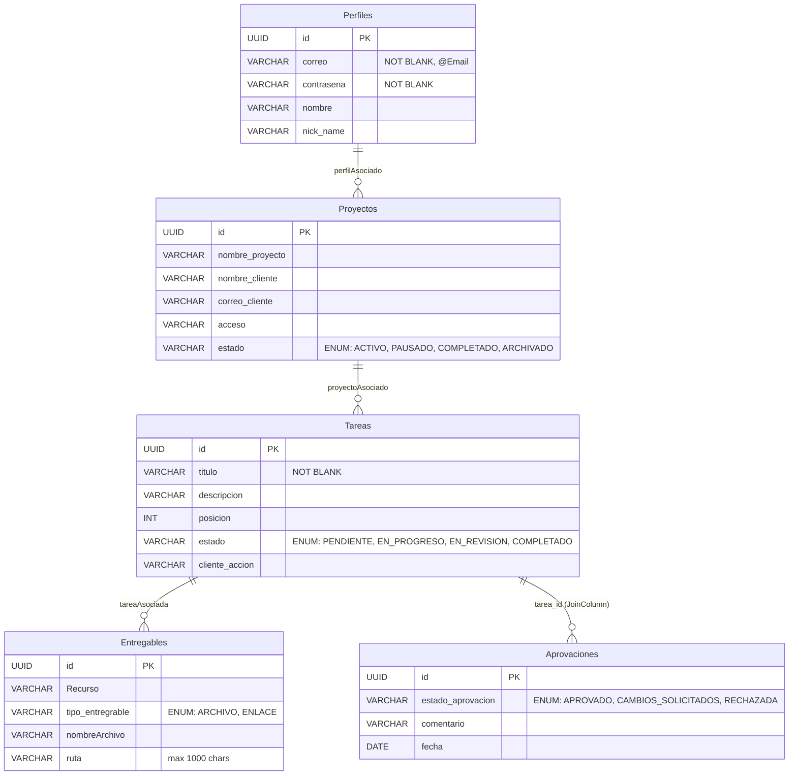

# Esquema de Base de Datos

## Motor y Configuración

| Parámetro | Valor |
|-----------|-------|
| Motor | MySQL 8+ |
| Driver | `com.mysql.cj.jdbc.Driver` |
| Dialecto | `org.hibernate.dialect.MySQLDialect` |
| DDL Auto | `update` (Hibernate genera/actualiza tablas automáticamente) |
| Sesiones | `spring-session-jdbc` con `initialize-schema=always` |

## Diagrama Entidad-Relación

## Detalle de Entidades

### PerfilEntity → Tabla `Perfiles`

| Campo | Tipo Java | Columna DB | Restricciones |
|-------|-----------|------------|---------------|
| `id` | `UUID` | `id` | PK, auto-generado |
| `correo` | `String` | `correo` | `@NotBlank`, `@Email` |
| `contraseña` | `String` | `contraseña` | `@NotBlank` |
| `nombre` | `String` | `nombre` | - |
| `nickName` | `String` | `nick_name` | - |
| `proyectos` | `List<ProyectoEntity>` | - | `@OneToMany` |

### ProyectoEntity → Tabla `Proyectos`

| Campo | Tipo Java | Columna DB | Restricciones |
|-------|-----------|------------|---------------|
| `id` | `UUID` | `id` | PK, auto-generado |
| `nombreProyecto` | `String` | `nombre_proyecto` | - |
| `nombreCliente` | `String` | `nombre_cliente` | - |
| `correoCliente` | `String` | `correo_cliente` | - |
| `acceso` | `String` | `acceso` | - |
| `estado` | `EstadosProyecto` | `estado` | Default: `ACTIVO` |
| `tareas` | `List<TareaEntity>` | - | `@OneToMany(orphanRemoval=true)` |
| `perfilAsociado` | `PerfilEntity` | FK | `@ManyToOne` |

### TareaEntity → Tabla `Tareas`

| Campo | Tipo Java | Columna DB | Restricciones |
|-------|-----------|------------|---------------|
| `id` | `UUID` | `id` | PK, auto-generado |
| `titulo` | `String` | `titulo` | `@NotBlank` |
| `descripcion` | `String` | `descripcion` | - |
| `posicion` | `int` | `posicion` | Orden de la tarea |
| `estado` | `EstadosTarea` | `estado` | Default: `PENDIENTE` |
| `clienteAccion` | `String` | `cliente_accion` | - |
| `recursos` | `List<EntregablesEntity>` | - | `@OneToMany(cascade=ALL, orphanRemoval=true)`, max 4 |
| `aprovaciones` | `List<AprovacionEntity>` | - | `@OneToMany(cascade=ALL, orphanRemoval=true)` vía `@JoinColumn` |
| `proyectoAsociado` | `ProyectoEntity` | FK | `@ManyToOne` |

### EntregablesEntity → Tabla `Entregables`

| Campo | Tipo Java | Columna DB | Restricciones |
|-------|-----------|------------|---------------|
| `id` | `UUID` | `id` | PK, auto-generado |
| `Recurso` | `String` | `Recurso` | - |
| `tipoEntregable` | `TipoEntregable` | `tipo_entregrable` | Enum STRING |
| `nombreArchivo` | `String` | `nombreArchivo` | - |
| `ruta` | `String` | `ruta` | `@Column(length=1000)` |
| `tareaAsociada` | `TareaEntity` | FK | `@ManyToOne` |

### AprovacionEntity → Tabla `Aprovaciones`

| Campo | Tipo Java | Columna DB | Restricciones |
|-------|-----------|------------|---------------|
| `id` | `UUID` | `id` | PK, auto-generado |
| `estadoAprovacion` | `EstadoAprovado` | `estado_aprovacion` | Enum STRING |
| `comentario` | `String` | `comentario` | - |
| `fecha` | `LocalDate` | `fecha` | - |

## Enumeraciones

### EstadosTarea
| Valor | Descripción |
|-------|-------------|
| `PENDIENTE` | Tarea creada, sin iniciar |
| `EN_PROGRESO` | Tarea en desarrollo activo |
| `EN_REVISION` | Tarea esperando revisión del cliente |
| `COMPLETADO` | Tarea finalizada |

### EstadosProyecto
| Valor | Descripción |
|-------|-------------|
| `ACTIVO` | Proyecto en curso (default) |
| `PAUSADO` | Proyecto temporalmente detenido |
| `COMPLETADO` | Proyecto finalizado |
| `ARCHIVADO` | Proyecto archivado para histórico |

### TipoEntregable
| Valor | Descripción |
|-------|-------------|
| `ARCHIVO` | Entregable subido como archivo físico |
| `ENLACE` | Entregable como URL externa |

### EstadoAprovado
| Valor | Descripción |
|-------|-------------|
| `APROVADO` | El cliente aprobó el entregable |
| `CAMBIOS_SOLICITADOS` | El cliente solicita modificaciones |
| `RECHAZADA` | El cliente rechazó el entregable |

## Relaciones Clave

| Relación | Tipo | Cascade | OrphanRemoval |
|----------|------|---------|---------------|
| Perfil → Proyectos | `@OneToMany` | No | No |
| Proyecto → Tareas | `@OneToMany(mappedBy)` | No | Sí |
| Tarea → Entregables | `@OneToMany(mappedBy, cascade=ALL)` | ALL | Sí |
| Tarea → Aprobaciones | `@OneToMany(@JoinColumn, cascade=ALL)` | ALL | Sí |
