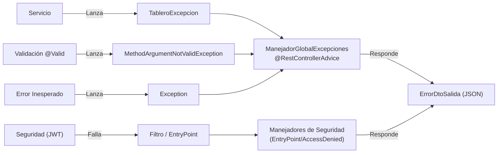

# Manejo de Errores

## Visión General

El proyecto implementa un **manejo de errores centralizado** mediante el patrón `@RestControllerAdvice`. Esto garantiza que todas las respuestas de error sigan un formato consistente, independientemente de dónde se origine la excepción.



## Componentes

### 1. TableroExcepcion

**Ubicación:** `excepciones/excepcion/TableroExcepcion.java`

Excepción personalizada del proyecto. Extiende `RuntimeException` y lleva consigo el código HTTP apropiado.

```java
// Uso en un servicio:
throw new TableroExcepcion(
    "El proyecto no fue encontrado", 
    HttpStatus.NOT_FOUND
);
```

| Campo | Tipo | Descripción |
|-------|------|-------------|
| `mensaje` | `String` | Heredado de `RuntimeException.getMessage()` |
| `estadoHttp` | `HttpStatus` | Código HTTP que se devolverá al cliente |

### 2. Manejadores de Excepciones

#### ManejadorGlobalExcepciones

**Ubicación:** `excepciones/handler/ManejadorGlobalExcepciones.java`

Clase anotada con `@RestControllerAdvice` que intercepta excepciones de forma global.

| Método | Excepción que Atrapa | Código HTTP | Cuándo se Activa |
|--------|----------------------|-------------|-------------------|
| `manejarTableroExcepcion` | `TableroExcepcion` | Dinámico | Errores de lógica de negocio |
| `manejarValidaciones` | `MethodArgumentNotValidException` | `400 Bad Request` | Fallos de `@Valid` en DTOs |
| `manejarExcepcionesGlobales` | `Exception` | `500 Internal Server Error` | Cualquier error no controlado |

#### Manejadores de Seguridad (Security Handlers)

**Ubicación:** `seguridad/`

| Clase | Código HTTP | Propósito |
|-------|-------------|-----------|
| `JwtAuthenticationEntryPoint` | `401 Unauthorized` | Se activa cuando el usuario no está autenticado o el token es inválido. |
| `JwtAccessDeniedHandler` | `403 Forbidden` | Se activa cuando el usuario está autenticado pero no tiene los roles necesarios. |

### 3. ErrorDtoSalida

**Ubicación:** `entidades/dtos/salida/ErrorDtoSalida.java`

Estructura estándar de respuesta de error.

```json
{
  "timestamp": "2026-03-22T22:00:00",
  "estado": 404,
  "mensaje": "El proyecto no fue encontrado",
  "detalles": "uri=/proyectos/uuid-invalido"
}
```

| Campo | Tipo | Descripción |
|-------|------|-------------|
| `timestamp` | `LocalDateTime` | Momento exacto del error |
| `estado` | `int` | Código HTTP numérico |
| `mensaje` | `String` | Descripción legible del error |
| `detalles` | `String` | URI o contexto de la petición |

## Ejemplos de Uso

### Lanzar error desde un servicio

```java
@Override
public ProyectoDtoSalida buscarProyecto(UUID id) {
    ProyectoEntity proyecto = proyectoRepositorio.findById(id)
        .orElseThrow(() -> new TableroExcepcion(
            "Proyecto con id " + id + " no encontrado", 
            HttpStatus.NOT_FOUND
        ));
    // ... mapear y retornar
}
```

### Error de validación automático

Si un `@RequestBody @Valid TareaDtoEntrada` falla validación, el handler devuelve automáticamente:

```json
{
  "timestamp": "2026-03-22T22:10:00",
  "estado": 400,
  "mensaje": "Error de validación: titulo: must not be blank",
  "detalles": "uri=/tarea"
}
```

## Reglas para Desarrolladores y Agentes

1. **NUNCA** usar `try-catch` en los Controladores para manejar errores de negocio.
2. **SIEMPRE** lanzar `TableroExcepcion` con el `HttpStatus` apropiado desde la capa de Servicio.
3. **NUNCA** retornar `ResponseEntity` con mensajes de error ad-hoc desde los controladores.
4. Para agregar un nuevo tipo de excepción específica, crear una subclase de `TableroExcepcion` y agregar un nuevo `@ExceptionHandler` en `ManejadorGlobalExcepciones`.
